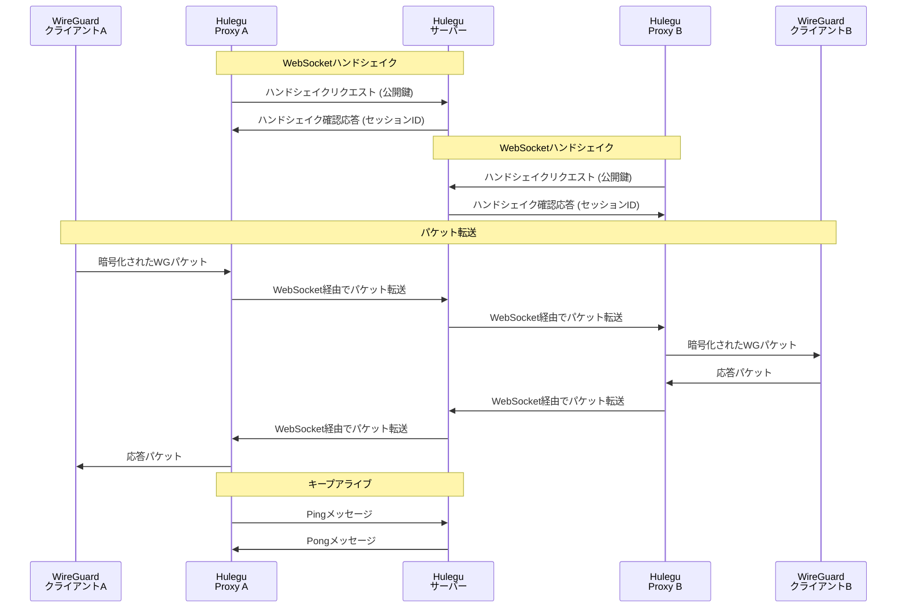
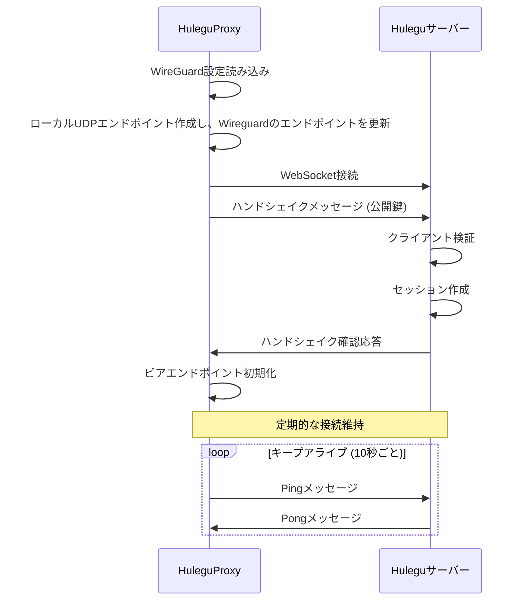

# Hulegu

Hulegu（フレグ）は、NATやファイアウォールの背後にあるWireGuardピア間の通信を可能にする中継システムです。
WebSocketを利用してWireGuardパケットを安全に中継し、Hard NAT配下やUDPの使用制限のある環境でもVPN接続を実現します。

## 概要
WireGuardは優れたVPNプロトコルですが、NATトラバーサルに弱点があります。Huleguはこの弱点を補うために、WebSocketベースのリレーを提供します。

また、Huleguは既存のWireGuardの設定を利用して通信を中継する仕組みです。
Linuxカーネルモジュール版のWireGuardでも動作し、WireGuard上でのPeer間通信は常にエンドツーエンドとなります。

## 主な機能

- WebSocketを介したWireGuardパケットの安全な中継
- 複数Peerでの通信を実現
- NATやファイアウォールを透過する安定した通信
- シンプルなクライアント/サーバーアーキテクチャ
- 効率的な並行処理と多重化
- 非復号によるWireGuard通信の中継を実現

## ビルド

```
git clone https://github.com/yourusername/hulegu.git
cd hulegu
# client
go build -o hulegu-client ./cmd/client/main.go
# server
go build -o hulegu-server ./cmd/server/main.go
```

## 利用方法

### server
```
sudo ./hulegu-server start --addr=:8080 --path=/ws
```
### client
```
sudo ./hulegu-client start --server=ws://[HUleguサーバホスト名・IPアドレス]:8080/ws --interface=[WireGuardインターフェース名] --enable-peer=[有効化するPeerの公開鍵] --enable-peer=[有効化するPeerの公開鍵]
```


## 通信フロー

### 基本的な通信フロー



### 初期化とセッション確立フロー



### WireGuard側の設定状態
huleguはWireGuardに設定されているendpoint情報をHuleguProxyが提供するUDPソケットに置き換えます。
```
root@hulegu-client01:/home/pabotesu/hulegu# wg
interface: wg0
  public key: 5fKV6E6wvyG/6bzx054Yydr2OrfxRV5ORMgueMEua0k=
  private key: (hidden)
  listening port: 48127

peer: cK3eHchrNz5FBfNH0OvaNxPE8j5BJml4GNRdTKnf/Sw=
  endpoint: 127.0.0.1:58710
  allowed ips: 100.100.0.3/32
  latest handshake: 2 seconds ago
  transfer: 44.47 KiB received, 59.07 KiB sent

peer: 7ymbF8R+X2l99LXliNP3G9n8kYnpG4qFFC7u0c5o+3U=
  endpoint: 127.0.0.1:57885
  allowed ips: 100.100.0.2/32
  latest handshake: 5 seconds ago
  transfer: 33.20 KiB received, 64.93 KiB sent
root@hulegu-client01:/home/pabotesu/hulegu#
```
